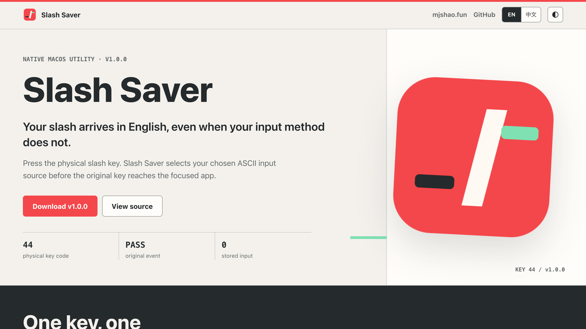

# Slash Saver

<p align="center">
  
</p>

<p align="center">
  A tiny native macOS utility that switches to your chosen ASCII input source before the physical <code>/</code> key reaches the focused app.
</p>

<p align="center">
  <a href="https://github.com/nxxxsooo/slash-saver/releases/latest"></a>
  <a href="https://github.com/nxxxsooo/slash-saver/actions/workflows/ci.yml"></a>
  
</p>



Slash Saver listens for one physical key and performs one action: when the ANSI slash key is pressed, it selects the ASCII input source you configured. The original key event continues untouched, so `/` or `?` is still typed normally.

It never switches back automatically, records typed characters, inspects the active application, or posts synthetic keyboard events.

## Download

Download the latest universal macOS build from [GitHub Releases](https://github.com/nxxxsooo/slash-saver/releases/latest).

The current release is Apple Development signed but not notarized. On first launch, macOS may require Control-clicking the app and choosing **Open**.

## First Run

1. Move `Slash Saver.app` to `/Applications`.
2. Control-click the app and choose **Open** if Gatekeeper blocks a normal launch.
3. Choose an ASCII input source from the live system list.
4. Grant **Input Monitoring** permission when prompted.
5. Leave **Launch at login** enabled if desired, then save.

Slash Saver has no Dock icon and no menu bar item. Open the app again to show settings; use **Quit** in settings to stop it.

## Updating

1. Open Slash Saver again and choose **Quit**.
2. Replace the existing app in `/Applications` with the new release.
3. Launch it once. Your target input source remains in macOS preferences.

If the keyboard rule stops after an update, remove Slash Saver from **System Settings > Privacy & Security > Input Monitoring**, launch it again, and grant access to the new copy.

## Uninstalling

1. Open Slash Saver, disable **Launch at login**, and save.
2. Open it again, choose **Quit**, then delete the app from `/Applications`.
3. Optionally remove Slash Saver from **System Settings > Privacy & Security > Input Monitoring**.

## Privacy and Security

- Requests Input Monitoring only so a passive `CGEventTap` can observe physical key-down events.
- Watches only `keyDown` and acts only on physical key code `kVK_ANSI_Slash` (`44`).
- Immediately ignores non-slash key metadata and does not record characters, application names, documents, or input history.
- Does not send analytics or make network requests.
- Returns the original event and never synthesizes replacement keyboard events.
- Runs outside the App Sandbox because sandboxed input-source selection was not reliable in focused text clients during testing.

## Behavior Contract

- Ignores Command, Control, and Option combinations.
- Ignores key autorepeat.
- Allows Shift, so the same physical key switches before `?` input.
- Skips selection when the configured source is already active.
- Stores the selected input-source ID instead of hard-coding `ABC` or `U.S.`.
- Resolves and retains the target source before monitoring starts.
- Calls `TISSelectInputSource` inside the passive event-tap callback before returning the original slash event.
- Slash-event handling never activates another application, creates a temporary focus window, or changes focus.

## Requirements

- macOS 13 or later
- ANSI-compatible physical slash key
- Input Monitoring permission
- Xcode 16 or later when building from source

## Build and Test

```sh
xcodebuild test \
  -project SlashSaver.xcodeproj \
  -scheme SlashSaver \
  -destination 'platform=macOS' \
  CODE_SIGNING_ALLOWED=NO
```

Open `SlashSaver.xcodeproj` in Xcode for local development. Debug builds use a separate bundle identifier so their preferences, privacy permission, and login-item state cannot overwrite the Release app.

## 中文说明

Slash Saver 是一个极小的原生 macOS 工具。按下物理 `/` 键时，它会在按键进入当前应用前切换到你选定的 ASCII 输入源，同时原始按键继续正常输入 `/` 或 `?`。

首次运行时，从系统当前启用的输入源列表里选择目标输入源，并授予「输入监控」权限。它没有 Dock 图标和菜单栏图标；再次打开应用即可进入设置。

它只观察按键按下事件，不记录字符、应用名、文档或输入历史，不联网，不模拟按键，也不会自动切回中文输入法。当前发布包已使用 Apple Development 证书签名，但尚未经过 Apple 公证；首次打开可能需要右键应用并选择「打开」。

## Known Limitations

- The trigger is the physical ANSI slash key, not a character produced by an alternate keyboard layout.
- Input-source behavior is ultimately provided by macOS Text Input Source Services and may vary with third-party input methods.
- The downloadable build is not notarized, so first-launch Gatekeeper handling is expected.
